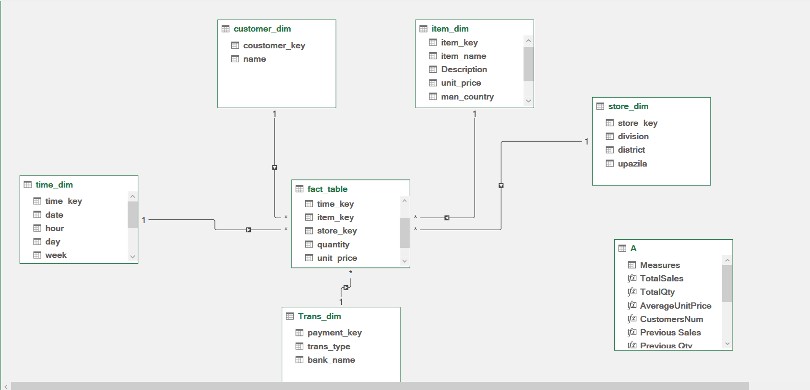
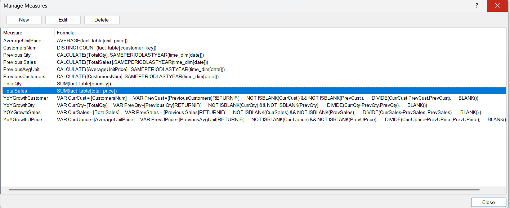
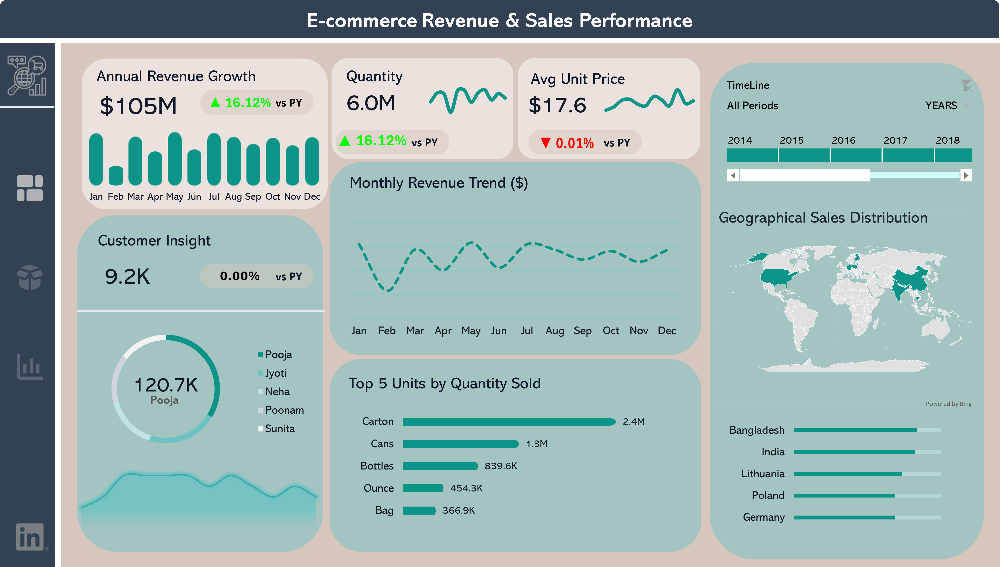
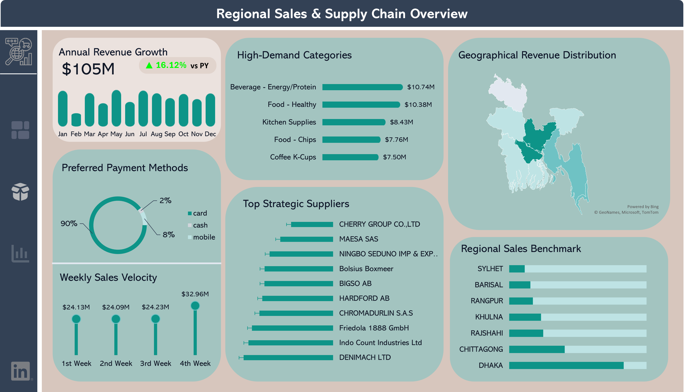

# E-commerce Revenue & Sales Performance Analysis (Excel & PowerPoint)

## 📌 Project Overview
This project is a comprehensive Business Intelligence (BI) solution built entirely within **Microsoft Excel**. It demonstrates how to transform raw, messy transactional data into a high-end interactive dashboard. By leveraging **Power Query**, **Power Pivot**, and **DAX**, this solution tracks Year-over-Year (YoY) growth, identifies supplier dependencies, and analyzes regional sales performance—all while maintaining a "Power BI-like" user experience.

---

## 🛠️ Technical Workflowg
The project is built on a high-performance foundation using Excel Power Tools:

### 1. Data Mashup (Power Query)
The foundation of the project is a clean and reliable data pipeline built using **Power Query** in Excel:
* **Data Cleaning**: Handled missing bank names (replacing "None" with "Un-known") and sanitized text fields.

* **Standardization**: Formatted customer names and product descriptions for consistent reporting.

* **Accuracy**: Removed duplicates and blank rows from the fact table to ensure no overestimation of revenue.

### 2. Advanced Data Modeling (Power Pivot)
Despite being built in Excel, the project utilizes a professional **Star Schema** architecture:

* **Fact Table**: Centralized `fact_table` containing over $105M in transactional data.

* **Dimension Tables**: 5 descriptive tables (`time_dim`, `item_dim`, `store_dim`, `customer_dim`, and `Trans_dim`) linked via 1:* (one-to-many) relationships.

* **Model Efficiency**: Optimized for performance to ensure slicers update the visuals instantly.

> 

---

## 3. Analytics & DAX Measures
Authored complex DAX (Data Analysis Expressions) formulas to drive the analytical engine:

* **YoY Growth**: Created dynamic measures for Sales, Quantity, and Customer growth.

* **Time Intelligence**: Used `SAMEPERIODLASTYEAR` to enable direct benchmarking against the previous year.

* **Advanced Logic**: Implemented `DIVIDE` and `VAR` logic to handle calculations safely (preventing division-by-zero errors).

> 

---

## 🎨 UI/UX Design (PowerPoint)
To achieve a modern look, **Microsoft PowerPoint** was used as a design tool to:

* Design a custom dashboard layout and background.

* Create a clean, non-standard Excel interface that prioritizes readability and visual hierarchy.

* Integrate interactive Excel Slicers and Pivot Charts seamlessly into the designed canvas.

---

## 📊 Key Business Insights
**Executive Performance**
* **Revenue Milestone**: Reached **$105M** in total sales with a solid **16.12% YoY growth**.

* **Sales Driver**: Revenue growth is purely volume-driven (**+16.12% Qty**), as the average unit price remained flat at **$17.6**.

* **Customer Base**: Maintained a stable active customer base of **9.2K users**.

**Supply Chain & Regional Trends**
* **Supplier Risk**: Revenue is moderately concentrated; **the top 3 suppliers account for 36% of total revenue**.

* **Category Winner**: "Beverage - Energy/Protein" is the leading category, contributing **$10.74M**.

* **Digital Adoption**: A massive **90% of transactions are paid via Card**, indicating a strong preference for digital payments.

---

## 🖼️ Dashboard Preview

To provide a clear and interactive user experience, I designed the dashboard layout in **PowerPoint** and integrated the data visuals in **Excel**. 

### Executive Overview

*Figure 1: High-level KPIs and Sales Trends.*

### Regional & Supplier Analysis

*Figure 2: Detailed view of supplier concentration and geographic performance.*

---

## 💡 Strategic Recommendations
### 1. **Reduce Supplier Risk**: Diversify the supplier portfolio to mitigate risks associated with the top 3 suppliers.

### 2. **Regional Optimization**: Dhaka is the primary revenue engine; investigate regional strategies to boost Chittagong and other districts.

### 3. **Loyalty Programs**: Leverage the 90% card-payment rate to launch targeted digital rewards or cashback programs.

---

## 🧰 Tools Used
* **Microsoft Excel**: Power Query, Power Pivot, DAX, Pivot Tables.

* **Microsoft PowerPoint**: Dashboard UI/UX & Graphic Design.

---

## 📂 Project Structure

To maintain clarity and organization, the repository is structured as follows:

* **[Data/](Data/)**: Contains the raw .
* **[Images/](Images/)**: Stores all visual assets, including data models and dashboard screenshots.
* **Analysis_Dashboard.xlsx**: The core Excel file containing Power Query, Power Pivot, and the final interactive dashboard.
* **Dashboard_Design.pptx**: The PowerPoint source file used for the UI/UX design and dashboard layout.

---

## 📂 Project Structure

To maintain clarity and organization, the repository is structured as follows:

* **[Data/](Data/)**: Contains the raw and cleaned datasets used for the analysis.
* **[Images/](Images/)**: Stores all visual assets, including data models and dashboard screenshots.
* **Analysis_Dashboard.xlsx**: The core Excel file containing Power Query, Power Pivot, and the final interactive dashboard.
* **Dashboard_Design.pptx**: The PowerPoint source file used for the UI/UX design and dashboard layout.

---

## 👨‍💻 Connect with Me

I’m a Data Analyst passionate about turning complex data into visual stories. Feel free to reach out for collaboration or questions:

